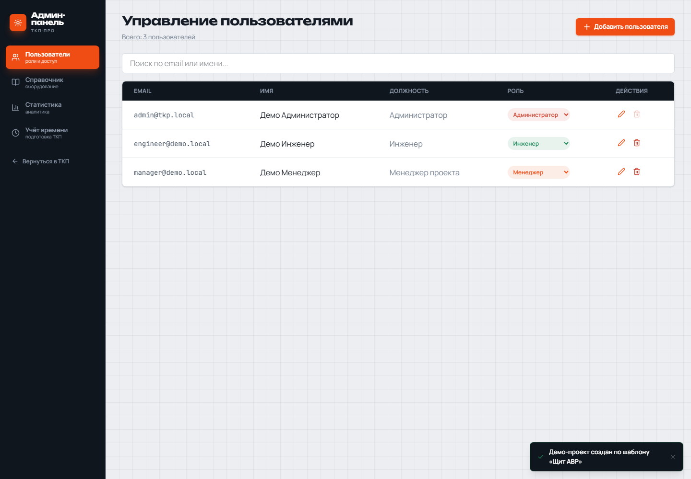
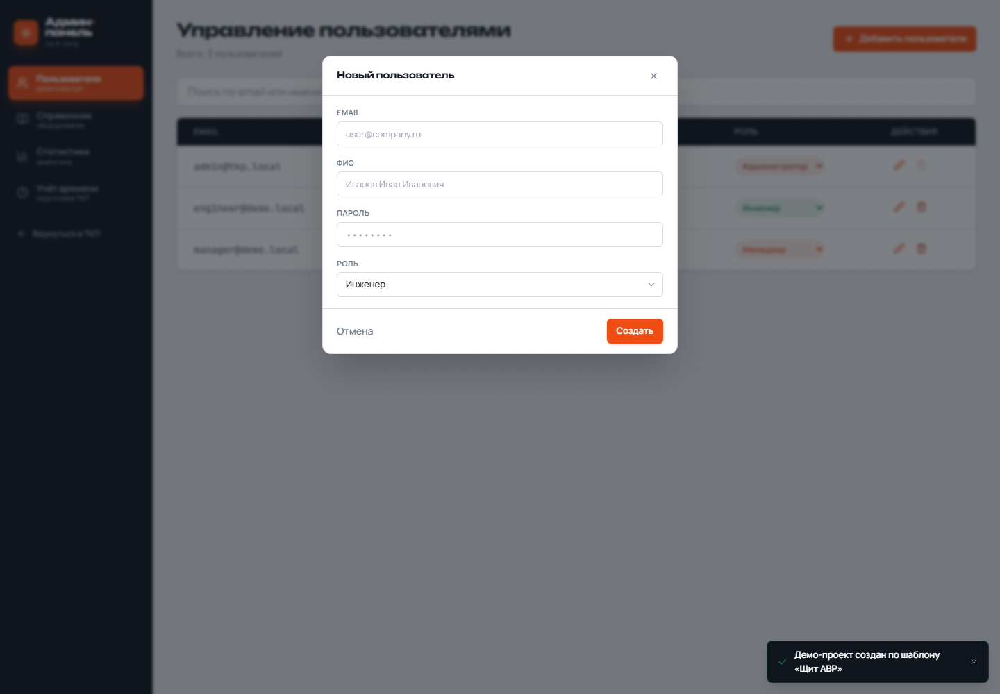
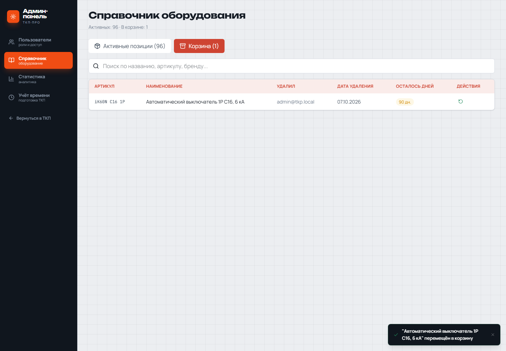
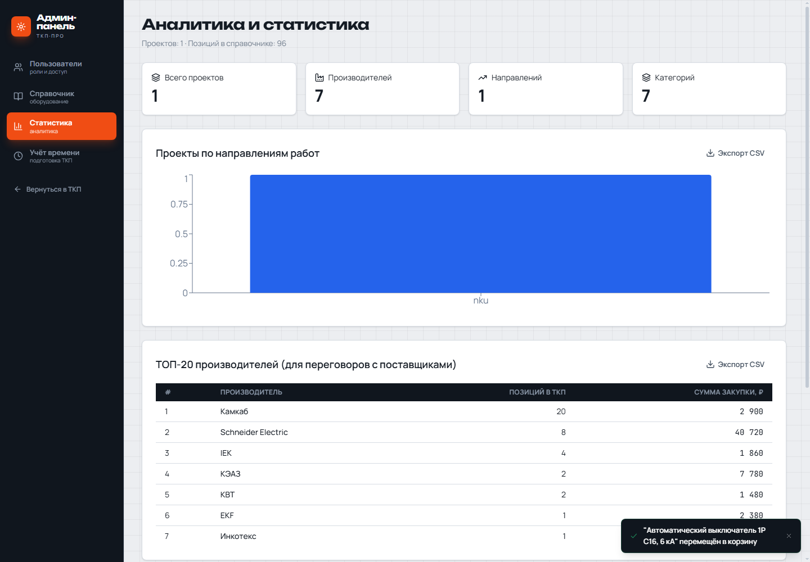

# Административная панель

Инструкция относится к административному контуру `admin-shell-v1` и
исправлению статистики ADMIN-005. Доступ к панели имеет только пользователь с
ролью администратора. Менеджер и инженер не видят ссылку и не могут открыть
административный маршрут напрямую.

## Открытие панели

Войдите в приложение под администратором и нажмите **Админ-панель**. Основная
работа с ТКП и административные операции находятся в разных оболочках. Для
возврата используйте пункт **Вернуться в ТКП**.

## Пользователи

Раздел **Пользователи** позволяет искать пользователей, создавать новую
учётную запись, менять роль и удалять пользователя.

При создании укажите email, ФИО, временный пароль и роль. Создавать
пользователей может только администратор. Текущего пользователя удалить нельзя;
система также не позволит удалить или разжаловать последнего администратора.
Конфликт показывается сообщением, данные при этом не изменяются.

## Справочник и корзина

В разделе **Справочник** доступны активные позиции и корзина. После удаления
позиция сохраняется в корзине вместе со снимком полей. Кнопка восстановления
возвращает её в активный справочник. При конфликте артикула или идентификатора
активная позиция не перезаписывается.

## Статистика

Раздел **Статистика** показывает количество проектов по направлениям,
количество производителей и категорий, а также TOP-20 производителей по числу
позиций и закупочной сумме. Таблицы направлений и производителей можно
экспортировать в CSV.

Сумма производителя рассчитывается по снимкам позиций внутри ТКП. Последующее
изменение цены или производителя в справочнике не переписывает историческую
статистику уже созданного ТКП. Карточка **Производителей** учитывает весь набор,
даже если в таблице показан только TOP-20.

Сейчас статистика охватывает все проекты. Фильтры по периоду и статусу требуют
отдельного продуктового решения и в этот выпуск не входят.

## Ограничения текущего среза

- NEED-001 остаётся частично закрытой до решения о фильтрах статистики,
  успешного CI, интеграции в `main` и выпуска версии.
- Учёт времени описывается отдельным контрактом TIME-001/TIME-002.
- Скриншоты используют только демонстрационные данные; реальные пароли и
  персональные данные в документацию не включены.
